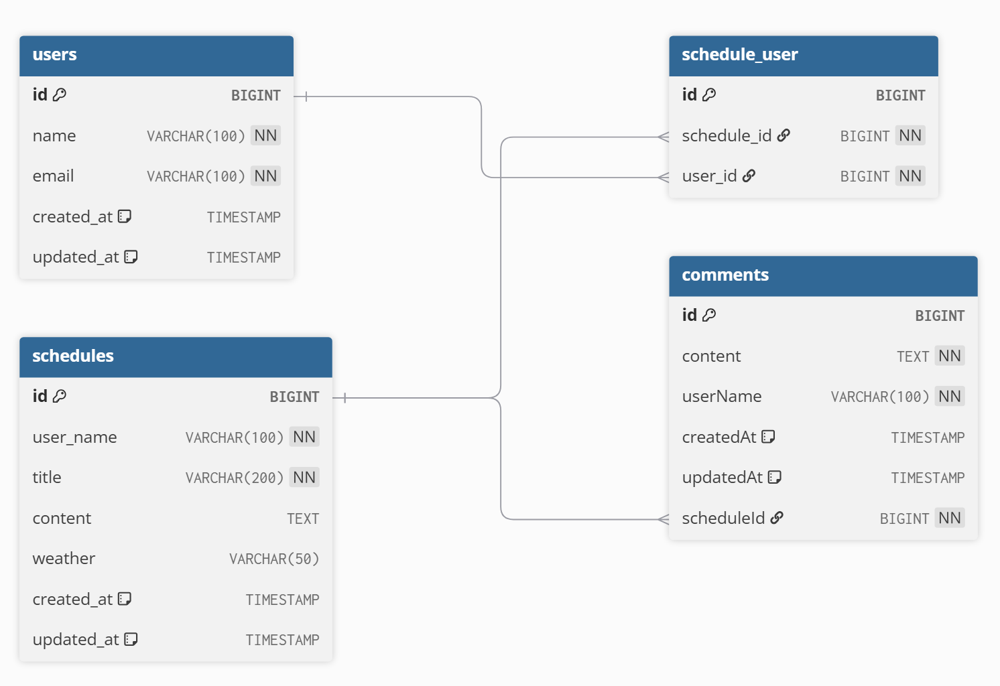

# 📅 일정 관리 웹 애플리케이션
- **JPA · JWT · 3계층 아키텍처** 기반의 **일정 / 댓글 / 유저 관리 프로젝트**
- **10단계 필수 기능 + 인증/인가 + 외부 API 연동**까지 완성된 백엔드 서버

---

## 🚀 프로젝트 개요

| 항목        | 내용                                                                                                  |
| --------- | --------------------------------------------------------------------------------------------------- |
| 🎯 목표     | 일정/댓글/유저 관리 기능 구현 & JWT 로그인/회원가입 및 권한 인증 포함                                                         |
| 🧱 아키텍처   | 3-Layer Architecture (Controller - Service - Repository)                                            |
| 🛠 기술 스택  | Spring Boot, JPA, MySQL, JWT, REST API, Lombok                                                      |
| 🔐 인증 방식  | JWT 기반 인증 & 인가 (필터 방식)                                                                              |
| 🔗 외부 API | 날씨 정보 조회 ([https://f-api.github.io/f-api/weather.json](https://f-api.github.io/f-api/weather.json)) |

## 🧩 구현 기능 (전체 단계)

| 단계     | 기능                       | 설명                                          |
| ------ | ------------------------ | ------------------------------------------- |
| ✅ 1단계  | 📄 일정 CRU                | 일정 저장, 단건 조회, 수정                            |
| ✅ 2단계  | 💬 댓글 CRUD               | 일정에 댓글 추가, 조회, 수정, 삭제 (일정 ↔ 댓글 연관 관계)        |
| ✅ 3단계  | 📚 일정 페이징 조회             | `Pageable` 사용, 수정일 기준 내림차순 정렬                 |
| ✅ 4단계  | 🧹 일정 삭제 시 댓글 자동 삭제      | 영속성 전이 (`cascade`) 활용                       |
| ✅ 5단계  | 👤 유저 CRUD + 일정 담당자 N\:M | 일정 작성자 → 유저 ID 연동, 유저 ↔ 일정 N\:M (중간 테이블 사용) |
| ✅ 6단계  | 🔎 일정 조회 개선              | 단건 조회 시 담당 유저 정보 포함, 전체 조회 시 미포함 (지연 로딩)    |
| ✅ 7단계  | 📝 회원 가입 + 비밀번호 암호화       | `BCrypt` 사용, JWT 즉시 발급                        |
| ✅ 8단계  | 🔐 로그인                   | JWT 로그인, 모든 요청 인증 처리, 예외 처리                 |
| ✅ 9단계  | 🔑 권한 확인                 | 관리자만 일정 수정/삭제 가능 (`role` 필드, JWT 내 권한 포함)   |
| ✅ 10단계 | ☀️ 외부 API 연동             | 일정 생성 시 날씨 API 호출하여 저장                      |

---

## 🗂 Task2 서비스 아키텍처
```yaml
      [ Client (프론트엔드) ]
                |
                ▼
      ┌────────────────────┐
      │  Controller Layer  │
      └────────────────────┘
      ┌────────────────────────────────────────────────────┐
      │ UserController       - 회원 가입/로그인             │
      │ ScheduleController   - 일정 생성/조회               │
      │ CommentController    - 댓글 등록/조회               │
      └────────────────────────────────────────────────────┘
                |
                ▼
      ┌────────────────────┐
      │   Service Layer    │
      └────────────────────┘
      ┌──────────────────────────────────────────────────────────────────────┐
      │ UserService        - 회원 로직 (비밀번호 암호화, 회원 등록 등)          │
      │ ScheduleService    - 일정 등록/수정/삭제                              │
      │ CommentService     - 댓글 등록/삭제                                   │
      │ WeatherService     - 외부 날씨 API 연동                               │
      │ JWTUtil            - JWT 토큰 생성 및 검증                            │
      └──────────────────────────────────────────────────────────────────────┘
                |
                ▼
      ┌────────────────────┐
      │  Repository Layer  │
      └────────────────────┘
      ┌────────────────────────────────────────────────────────────┐
      │ UserRepository         - 유저 DB 처리                       │
      │ ScheduleRepository     - 일정 DB 처리                       │
      │ CommentRepository      - 댓글 DB 처리                       │
      │ ScheduleUserRepository - 일정-유저 관계 처리                 │
      └────────────────────────────────────────────────────────────┘
                |
                ▼
      ┌────────────────────┐
      │    Entity Layer    │
      └────────────────────┘
      ┌────────────────────────────────────────────────────────────┐
      │ UserEntity           - 유저 엔티티                          │
      │ ScheduleEntity       - 일정 엔티티                          │
      │ CommentEntity        - 댓글 엔티티                          │
      │ ScheduleUserEntity   - N:M 관계 엔티티                      │
      └────────────────────────────────────────────────────────────┘
```

---

## 🎯 ERD(Entity Relationship Diagram)

### 📌 users — 유저 정보 테이블

| 필드명         | 타입                   | 설명       |
| ----------- | -------------------- | -------- |
| id          | BIGINT (PK)          | 유저 고유 ID |
| name        | VARCHAR(100)         | 유저 이름    |
| email       | VARCHAR(100, UNIQUE) | 유저 이메일   |
| created\_at | TIMESTAMP            | 생성 시각    |
| updated\_at | TIMESTAMP            | 수정 시각    |

### 📌 schedules — 일정 정보 테이블

| 필드명         | 타입           | 설명         |
| ----------- | ------------ | ---------- |
| id          | BIGINT (PK)  | 일정 고유 ID   |
| user\_name  | VARCHAR(100) | 작성 유저 이름   |
| title       | VARCHAR(200) | 일정 제목      |
| content     | TEXT         | 일정 내용      |
| weather     | VARCHAR(50)  | 생성 시 날씨 정보 |
| created\_at | TIMESTAMP    | 생성 시각      |
| updated\_at | TIMESTAMP    | 수정 시각      |

### 📌 comments — 댓글 테이블

| 필드명        | 타입           | 설명                    |
| ---------- | ------------ | --------------------- |
| id         | BIGINT (PK)  | 댓글 고유 ID              |
| content    | TEXT         | 댓글 내용                 |
| userName   | VARCHAR(100) | 댓글 작성자 이름             |
| createdAt  | TIMESTAMP    | 생성 시각                 |
| updatedAt  | TIMESTAMP    | 수정 시각                 |
| scheduleId | BIGINT (FK)  | 연결된 일정 ID (schedules) |

✅ `scheduleId`는 `schedules(id)`를 참조하며, <br>
&nbsp;&nbsp;&nbsp;&nbsp;&nbsp;&nbsp;**일정 삭제 시** 해당 댓글도 함께 삭제됨 (`ON DELETE CASCADE`)
<br>

### 📌 schedule_user — 일정 담당자 매핑 테이블 (N:M 관계)

| 필드명          | 타입          | 설명                    |
| ------------ | ----------- | --------------------- |
| id           | BIGINT (PK) | 매핑 고유 ID              |
| schedule\_id | BIGINT (FK) | 연결된 일정 ID (schedules) |
| user\_id     | BIGINT (FK) | 연결된 유저 ID (users)     |

✅ `schedule_id`와 `user_id`는 각각 `schedules`, `users` 테이블과 외래 키로 연결되며, <br>
&nbsp;&nbsp;&nbsp;&nbsp;&nbsp;&nbsp;**일정 또는 유저 삭제 시** 매핑도 함께 삭제됨 (`ON DELETE CASCADE`)
<br>

### 🖼 ERD 시각화


---

## 📘 API 명세서

**🔹 User (회원)**

| 기능    | 메서드    | URL           | 요청 필드           | 응답 필드                                           |
| ----- | ------ | ------------- | --------------- | ----------------------------------------------- |
| 유저 등록 | POST   | `/users`      | `name`, `email` | `id`, `name`, `email`, `createdAt`, `updatedAt` |
| 유저 조회 | GET    | `/users/{id}` | -               | `id`, `name`, `email`, `createdAt`, `updatedAt` |
| 유저 전체 | GET    | `/users`      | -               | `List<id, name, email, createdAt>`              |
| 유저 삭제 | DELETE | `/users/{id}` | -               | (204 No Content)                                |
<br>

**🔹 Schedule (일정)**

| 기능        | 메서드    | URL                              | 요청 필드                                         | 응답 필드                                  |
| --------- | ------ | -------------------------------- | --------------------------------------------- | -------------------------------------- |
| 일정 등록     | POST   | `/schedules`                     | `title`, `content`, `userName`, `assigneeIds` | `id`, `title`, `userName`, `assignees` |
| 일정 단건 조회  | GET    | `/schedules/{id}`                | -                                             | 일정 상세 + 담당자 정보                         |
| 일정 전체 조회  | GET    | `/schedules`                     | -                                             | 일정 목록 (담당자 제외)                         |
| 일정 수정     | PUT    | `/schedules/{id}`                | `title`, `content`                            | 수정된 일정 정보                              |
| 일정 삭제     | DELETE | `/schedules/{id}`                | -                                             | (`204 No Content`), 댓글도 함께 삭제            |
| 일정 페이징 조회 | GET    | `/schedules?pageNo=0&pageSize=0` | -                                             | 수정일 기준 내림차순 정렬된 일정 목록                  |
<br>

**🔹 Comment (댓글)**

| 기능       | 메서드    | URL                                | 요청 필드                 | 응답 필드                                     |
| -------- | ------ | ---------------------------------- | --------------------- | ----------------------------------------- |
| 댓글 등록    | POST   | `/schedules/{scheduleId}/comments` | `userName`, `content` | 댓글 정보                                     |
| 댓글 단건 조회 | GET    | `/comments/{id}`                   | -                     | `id`, `userName`, `content`, `scheduleId` |
| 댓글 전체 조회 | GET    | `/schedules/{scheduleId}/comments` | -                     | 댓글 목록                                     |
| 댓글 수정    | PUT    | `/comments/{id}`                   | `content`             | 수정된 댓글 정보                                 |
| 댓글 삭제    | DELETE | `/comments/{id}`                   | -                     | (`204 No Content`)                          |

---

## 🛡 JWT & 권한 정책

| 항목       | 정책                                      |
| -------- | --------------------------------------- |
| 회원 가입     | `POST /users/signup` → 회원 생성 후 JWT 반환   |
| 로그인      | `POST /users/login` → 로그인 성공 시 JWT 반환   |
| 인증 대상 제외 | `/users/signup`, `/users/login` 만 인증 제외 |
| 권한 정책    | 일정 수정/삭제는 `ROLE_ADMIN` 권한만 가능           |
| 예외 처리    | `400` (토큰 없음), `401` (만료/불일치), `403` (권한 없음)  |

---

## 🌦 날씨 연동 API
- 일정 생성 시, 외부 API에서 날씨 조회:
  - `GET https://f-api.github.io/f-api/weather.json`
  - 저장 필드: `weather` (ex. _"Rainy and Stormy"_, _"Sleet"_, _"Cloudy and Cool"_)
 
---

## 🧪 테스트 및 실행

### 🔗 Postman 테스트
- 유저 → `/users`
- 일정 → `/schedules`
- 댓글 → `/schedules/{id}/comments`
- 토큰은 `Authorization: Bearer <token>` 형식으로 포함

### 🔧 실행 방법
```bash
# 1. 의존성 설치
./gradlew build

# 2. 애플리케이션 실행
./gradlew bootRun
```
